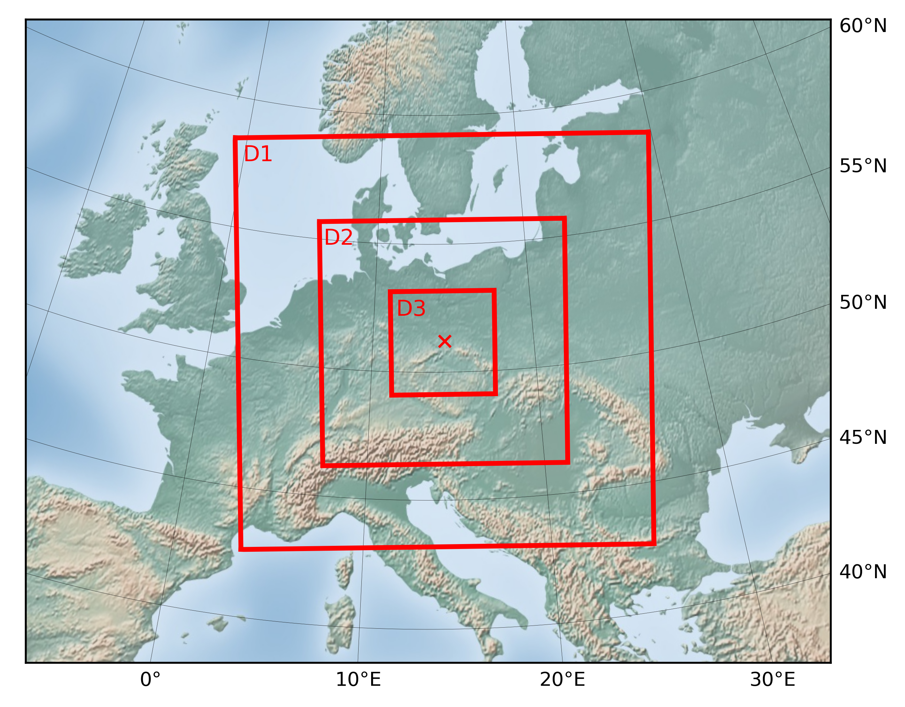

[](https://)
[](https://)
[](https://www2.mmm.ucar.edu/wrf/OnLineTutorial/index.php)
[](https://)


Modelling Bautzen barrage with WRF 4.3.1.

## Data Sources
ERA5 reanalysis data: https://cds.climate.copernicus.eu/cdsapp#!/dataset/reanalysis-era5-single-levels?tab=overview    
Static geographical data: https://www2.mmm.ucar.edu/wrf/src/wps_files/

## Usage
Compile WRF by the help of https://github.com/lenamueller/compile_WRF_on_Taurus   
Download ERA5 reanalysis data with ```./CDS_download/download.sh```   

## Overview
   

## Dependencies 
#### modelling
OpenMPI (4.0.4)
cURL (7.69.1)
freeglut (3.2.1)
CMake (3.22.1)
GCC (9.3.0)

#### virtual environment (api script, plotting)
alabaster                     0.7.12
appdirs                       1.4.4
asn1crypto                    1.4.0
atomicwrites                  1.4.0
attrs                         21.2.0
Babel                         2.9.1
basemap                       1.3.2
basemap-data                  1.3.2
bcrypt                        3.2.0
bitstring                     3.1.7
blist                         1.3.6
CacheControl                  0.12.6
cachy                         0.3.0
certifi                       2020.12.5
cffi                          1.14.5
cftime                        1.6.0
chardet                       4.0.0
cleo                          0.8.1
click                         7.1.2
clikit                        0.6.2
colorama                      0.4.4
crashtest                     0.3.1
cryptography                  3.4.7
cycler                        0.11.0
Cython                        0.29.23
decorator                     5.0.7
distlib                       0.3.1
docopt                        0.6.2
docutils                      0.17.1
ecdsa                         0.16.1
filelock                      3.0.12
flit                          3.2.0
flit_core                     3.2.0
fonttools                     4.30.0
fsspec                        2021.4.0
future                        0.18.2
html5lib                      1.1
idna                          2.10
imagesize                     1.2.0
importlib-metadata            4.0.1
iniconfig                     1.1.1
intervaltree                  3.1.0
intreehooks                   1.0
ipaddress                     1.0.23
jeepney                       0.6.0
Jinja2                        2.11.3
joblib                        1.0.1
jsonschema                    3.2.0
keyring                       21.8.0
keyrings.alt                  4.0.2
kiwisolver                    1.3.2
liac-arff                     2.5.0
lockfile                      0.12.2
MarkupSafe                    1.1.1
matplotlib                    3.5.1
mock                          4.0.3
more-itertools                8.7.0
msgpack                       1.0.2
netaddr                       0.8.0
netCDF4                       1.5.8
netifaces                     0.10.9
nose                          1.3.7
numpy                         1.22.3
packaging                     20.9
paramiko                      2.7.2
pastel                        0.2.1
pathlib2                      2.3.5
paycheck                      1.0.2
pbr                           5.6.0
pexpect                       4.8.0
Pillow                        9.0.1
pip                           22.0.4
pkginfo                       1.7.0
pluggy                        0.13.1
poetry                        1.1.6
poetry-core                   1.0.3
psutil                        5.8.0
ptyprocess                    0.7.0
py                            1.10.0
py-expression-eval            0.3.13
pyasn1                        0.4.8
pycparser                     2.20
pycrypto                      2.6.1
Pygments                      2.9.0
pylev                         1.3.0
PyNaCl                        1.4.0
pyparsing                     2.4.7
pyproj                        3.3.0
pyrsistent                    0.17.3
pyshp                         2.1.3
pytest                        6.2.4
python-dateutil               2.8.1
pytoml                        0.1.21
pytz                          2021.1
regex                         2021.4.4
requests                      2.25.1
requests-toolbelt             0.9.1
scandir                       1.10.0
SecretStorage                 3.3.1
semantic-version              2.8.5
setuptools                    56.2.0
setuptools-rust               0.12.1
setuptools-scm                6.0.1
shellingham                   1.4.0
simplegeneric                 0.8.1
simplejson                    3.17.2
six                           1.15.0
snowballstemmer               2.1.0
sortedcontainers              2.3.0
Sphinx                        4.0.0
sphinx-bootstrap-theme        0.7.1
sphinxcontrib-applehelp       1.0.2
sphinxcontrib-devhelp         1.0.2
sphinxcontrib-htmlhelp        1.0.3
sphinxcontrib-jsmath          1.0.1
sphinxcontrib-qthelp          1.0.3
sphinxcontrib-serializinghtml 1.1.4
sphinxcontrib-websupport      1.2.4
tabulate                      0.8.9
threadpoolctl                 2.1.0
toml                          0.10.2
tomlkit                       0.7.0
ujson                         4.0.2
urllib3                       1.26.4
virtualenv                    20.4.6
wcwidth                       0.2.5
webencodings                  0.5.1
wheel                         0.36.2
xlrd                          2.0.1
zipp                          3.4.1
